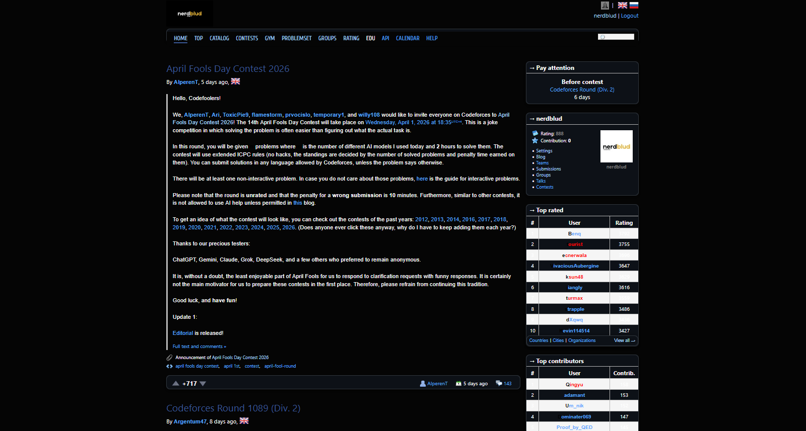

# Codeforces Dark Theme

A performance-optimized, modular dark theme for Codeforces. [**Click to install**](https://github.com/nerdblud/CodeForcesDarkTheme/raw/master/darktheme.user.js) (requires a userscript manager).

**Accessibility Standards**: This theme is built with WCAG compliance as a priority. All primary UI surfaces and text elements clear the minimum AA accessibility contrast ratio of 4.5:1, with high-use components exceeding the AAA ratio of 7:1 to minimize eye strain during long-form competitive programming.

---

## Installation Instructions

1. Install a userscript manager such as **Tampermonkey** or **Violentmonkey**.
2. [**Click here**](https://github.com/nerdblud/CodeForcesDarkTheme/raw/master/darktheme.user.js) to install the Codeforces Modern Dark Theme script.

The script is configured with `@run-at document-start` to ensure styles are injected before the initial page paint, eliminating the "white flash" common in traditional dark mode extensions.

---

## Project Architecture

This repository is organized into five core modules to ensure maintainability and high performance:

* **`darktheme.user.js`**: The injection engine. It handles DOM mutation observers, Ace Editor theme locking, and manages the lifecycle of the CSS resources.
* **`main.css`**: The core UI framework. Contains CSS variables for the "Midnight" palette and overrides for the Codeforces layout, tables, and form components.
* **`desert.css`**: A refined syntax highlighting theme based on the classic Desert palette, optimized for the Google Prettify engine used in problem statements and submissions.
* **`LICENSE`**: MIT License.
* **`README.md`**: Project documentation and technical specifications.

---

## Technical Specifications

### 1. Rating Color Recalibration
To maintain visual hierarchy against a `#0D1117` background, user handle colors have been adjusted for optimal contrast. These shifts are mathematically tuned to improve readability while preserving the "spirit" of the original rank colors.

| Rank Group | Hex Code | Visual Reference |
| :--- | :--- | :--- |
| Admins / Legendary (First Letter) | `#FFFFFF` | `#FFFFFF` |
| Grandmaster / Legendary | `#FF4747` | `#FF4747` |
| Candidate Master | `#CE8AFF` | `#CE8AFF` |
| Expert | `#757DFF` | `#757DFF` |
| Specialist | `#01BDB2` | `#01BDB2` |
| Pupil | `#00C700` | `#00C700` |
| Newbie | `#8C8C8C` | `#8C8C8C` |

### 2. Implementation Details
* **Zero-Flash Tech**: Utilizes `@resource` tags and `GM_getResourceText` to load style sheets into memory instantly upon document initialization.
* **Ace Editor Sync**: Implements a `MutationObserver` to force-override the internal Ace Editor theme to `ace-monokai`, preventing the default light-theme flicker during submission loads.
* **Legacy Cleanup**: Explicitly targets and removes legacy background image assets (e.g., `roundbox-lt`, `roundbox-rt`) in favor of modern CSS `border-radius` and `border` properties.

---

## External Dependencies

The syntax highlighting logic relies on the following standard libraries:
1. **Google Code-Prettify (Desert)**: Adapted for problem statement code blocks.
2. **Ace Editor (Monokai)**: Integrated for the source code submission box.

---

## Contribution Guidelines

Pull Requests are welcome. To contribute:
1. Open an issue to discuss proposed UI changes or identify styling regressions.
2. Ensure any new color variables maintain a minimum 4.5:1 contrast ratio against the primary background.
3. Target the `master` branch for all submissions.

---

## Inspired By

[GaurangTandon Github Dark Theme](https://github.com/GaurangTandon/codeforces-darktheme)

---

## License

MIT License © 2026. See the `LICENSE` file for details.